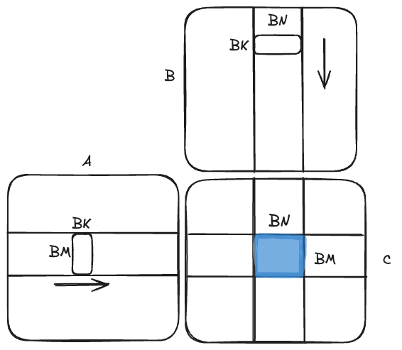
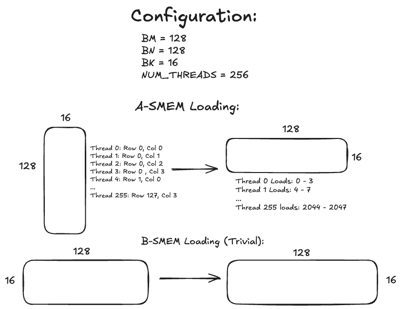
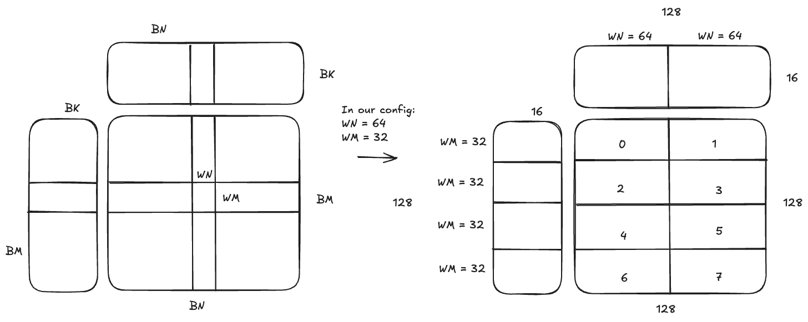
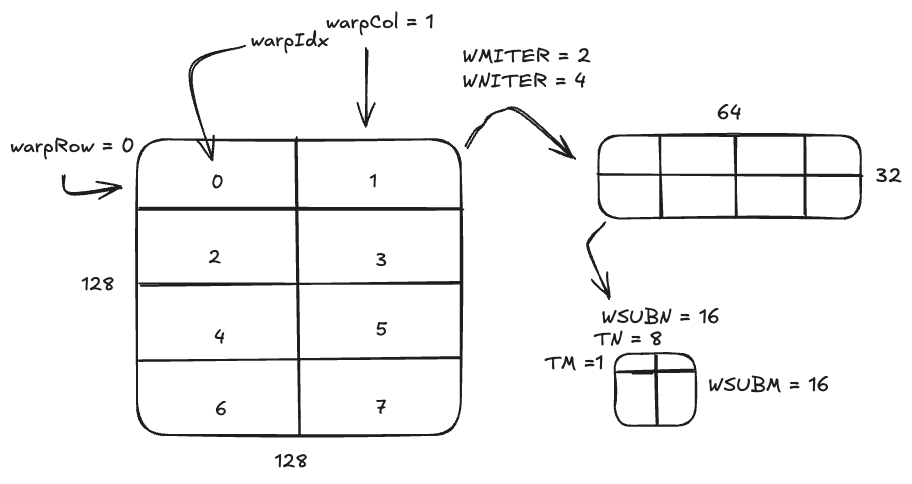

# Outer loop

The high level view of the outer most loop of computation is pretty simple, it iterates across a row of A with an A tile of BM x BK and iterates down a column of B with a B tile of BK x BN. Once they have both advanced across/down their computation, a BM x BN block of C will be computed.



Right now, the relevant code is:
```
// Set the row and col variables
const uint cRow = blockIdx.y;
const uint cCol = blockIdx.x;
...
// Advance the matrix pointers.
A += cRow * BM * K;
B += cCol * BN;
...
// Iterate across all blocks in the K dimension
for (uint bkIdx = 0; bkIdx < K; bkIdx += BK) {...}
```
## SMEM Loads in Outer loop
One of the key optimizations found in [Siboehm's blog](https://siboehm.com/articles/22/CUDA-MMM) was to transpose the A tile so that we can vectorize the shared memory loads. This is done with a few different indexing variables:
```
const uint innerRowA = threadIdx.x / (BK / 4);
const uint innerColA = threadIdx.x % (BK / 4);
constexpr uint rowStrideA = NUM_THREADS / (BK / 4);
const uint innerRowB = threadIdx.x / (BN / 4);
const uint innerColB = threadIdx.x % (BN / 4);
constexpr uint rowStrideB = NUM_THREADS / (BN / 4);
```
Since we use the `float4` datatype, we separate everything into groups of 4. Here, we divide the inners region into groups of 4 and assign threads sequentially there. rowStrideA simply tells us how many threads we need to cover a fourth of the width of the block. Of course, these variables are symmetrical with the B tile, except it uses BN in place of BK. The actual loading once again leverages the `float4` datatype, so anytime `innerColA` is mentioned it is followed by 4 (to fill the rest of the row).
```
const float4 tmp = reinterpret_cast<const float4 *>(
	&A[(innerRowA + offset) * K + innerColA * 4])[0];
	As[(innerColA * 4 + 0) * BM + innerRowA + offset] = tmp.x;
	As[(innerColA * 4 + 1) * BM + innerRowA + offset] = tmp.y;
	As[(innerColA * 4 + 2) * BM + innerRowA + offset] = tmp.z;
	As[(innerColA * 4 + 3) * BM + innerRowA + offset] = tmp.w;
```
This transposes the A tile as it gets the 4 elements from the start of the threads indexing and sets them equal to a flipped index in As ([row, col] -> [col,row]). Here is a picture of the entire process. 

  

The B-SMEM loading process is simple: 
```
reinterpret_cast<float4 *>( 
	&Bs[(innerRowB + offset) * BN + innerColB * 4])[0] =
reinterpret_cast<const float4 *>(
	&B[(innerRowB + offset) * N + innerColB * 4])[0];
```


# Middle Loop
Now that the tiles have been set up properly and loaded into Shared Memory, we need to get closer to performing computation. This loop goes over all BK elements:
```
for (uint dotIdx = 0; dotIdx < BK; ++dotIdx) {...}
```
In every iteration across this dimension, we need to load elements into the registerfiles:
```
// It is worth noting that TM = 1 here so we don't necessarily need it
float regM[WMITER * TM] = {0.0};
float regN[WNITER * TN] = {0.0};
```
The next step of breaking down our original matrix into smaller chunks comes in separating blocks of BM x BN into multiple chunks of WM x WN:



This is done with the help of some smart index variables
```
const uint warpIdx = threadIdx.x / WARPSIZE; // Which warptile are we in
const uint warpCol = warpIdx % (BN / WN); // Which column of warptiles
const uint warpRow = warpIdx / (BN / WN); // Which row of warptiles

constexpr uint WMITER = (WM * WN) / (WARPSIZE * TM * TN * WNITER);
constexpr uint WSUBM = WM / WMITER;
constexpr uint WSUBN = WN / WNITER; 

const uint threadIdxInWarp = threadIdx.x % WARPSIZE;
const uint threadColInWarp = threadIdxInWarp % (WSUBN / TN); 
const uint threadRowInWarp = threadIdxInWarp / (WSUBN / TN); 
```
WMITER is determined by dividing the total elements in the warptile by the number of elements computed per iteration. WSUBM and WSUBN tell us the dimensions of the chunks broken up by WMITER and WNITER. The WSUBM x WSUBN chunks are finally broken up into chunks the size of TN x TM, which is where the last 3 variables are used to load elements into registerfiles.



Now, at the finest-grained level we have a TM x TN chunk which is where we load into the register files. With TM = 1 in our kernel, loading into regM is simple:
```
for (uint wSubRowIdx = 0; wSubRowIdx < WMITER; ++wSubRowIdx) {
	regM[wSubRowIdx] = As[(dotIdx * BM) + warpRow * WM +
		wSubRowIdx * WSUBM + threadRowInWarp * TM];
}
```
So, for every WMITER block you store 1 element which is the thread's A element. For regN, we store 8 elements at each WNITER.
```
for (uint wSubColIdx = 0; wSubColIdx < WNITER; ++wSubColIdx) {
	for (uint i = 0; i < TN; ++i) {
		regN[wSubColIdx * TN + i] = Bs[(dotIdx * BN) + warpCol * 
			WN + wSubColIdx * WSUBN + threadColInWarp * TN + i];
	}
}
```
In both of these, the indexing works like this, find the row or column in the blocktile, find the warptile and find the column within the warptile, find where the thread should be in the warp and then start loading elements (1 for TM, 8 for TN). So now you have the 1x8 (TM x TN) segment that each thread does that completes the WSUBM x WSUBN matrix that is combined to complete the WM x WN matrix that combines to complete the blocktiling matrix which is done across the whole A and B matrices to compute the result.

# Inner Loop
Basic matrix multiplication that uses the register files and the thread results array to store elements to be written back.

# Writing Results Back
At a glance, this looks complicated because there is a lot going on:
```
for (uint wSubRowIdx = 0; wSubRowIdx < WMITER; ++wSubRowIdx) {
	for (uint wSubColIdx = 0; wSubColIdx < WNITER; ++wSubColIdx) {
		float *C_interim = C + (wSubRowIdx * WSUBM) * N + wSubColIdx * WSUBN;
		for (uint resIdxM = 0; resIdxM < TM; resIdxM += 1) {
			for (uint resIdxN = 0; resIdxN < TN; resIdxN += 4) {
				float4 tmp;
				const int i = (wSubRowIdx * TM + resIdxM) * (WNITER * TN) +
					wSubColIdx * TN + resIdxN;
				tmp.x = threadResults[i + 0];
				tmp.y = threadResults[i + 1];
				tmp.z = threadResults[i + 2];
				tmp.w = threadResults[i + 3];
				reinterpret_cast<float4 *>(
							&C_interim[(threadRowInWarp * TM + resIdxM) * N +
							threadColInWarp * TN + resIdxN])[0] = tmp;
			}
		}
	}	
}	
```
However, at a closer look, for every WMITER block you go across all of the WNITER blocks. Then, you grab the memory in C where the thread writes to. Since TM is 1 we don't need the second-most inner loop. The inner-most loop increments by 4 since it writes 4 elements at a time by getting the threadResults at the specific index, writing it to a `float4` type and then setting the place in C to be equal to that `float4` type, thus writing 4 computed elements at a time. Note: `const int i` is calculated in relative terms based on the WSUBM x WSUBN tile because threadResults is stored in a relative fashion.
